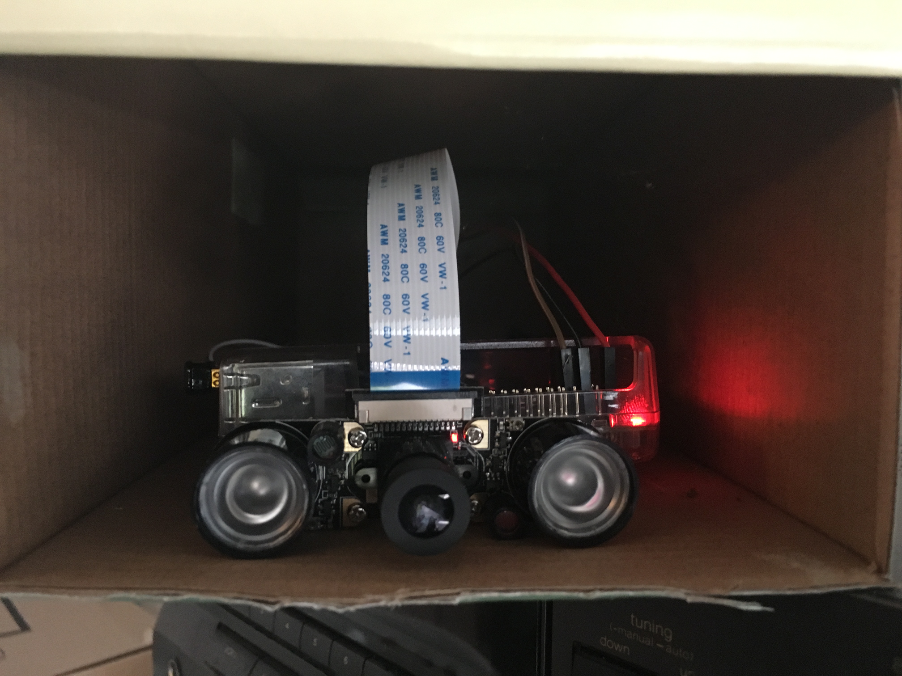

## GaragePI for Node; Powered by Trusona

This fork injects [Trusona](https://trusona.com) into the authorization flow by using the Trusona C SDK to trusonafy the configured email address.

Besides that modification and some rudimentary node updates, the rest of the steps followed to setup and modify the [raspeberry pi](https://www.raspberrypi.org) are detailed [here](https://coderwall.com/p/jsd5mw/raspberry-pi-garage-door-opener-with-garagepi).

The pi is setup in a shoebox. 

For live feed view head on to [garage.nmcode.net](http://garage.nmcode.net)

#### Todo:

Setup up and configure [Let's Encrypt](https://letsencrypt.org).

------

#### Prefork ReadMe

> GaragePI is a Raspberry PI project that allows you to open your garage door with your smartphone. 
> You can read more about the details at the link below if you're interested.
> https://coderwall.com/p/jsd5mw/raspberry-pi-garage-door-opener-with-garagepi
